# Linux 一键换源脚本


一个智能化的Linux换源工具，支持Ubuntu、Kali Linux、Arch Linux和Parrot OS系统，自动选择最优国内镜像源（阿里云、中科大、清华）。

## 功能亮点

### 🌐 智能网络诊断
- 镜像站可达性测试
- DNS解析验证
- 实时延迟测量

### ⚡ 智能源选择
- 自动测试阿里云、中科大、清华源
- 选择延迟最低的镜像源
- 基于实际网络状况动态选择

### 🔄 安全操作流程

```mermaid
graph TD
    A[检测系统] --> B[网络诊断]
    B --> C[智能测速]
    C --> D[用户确认]
    D --> E[备份源]
    E --> F[设置新源]
    F --> G[更新验证]
```


## 支持系统

| 系统                                                                                                      | 版本                                           | 支持状态     |
| --------------------------------------------------------------------------------------------------------- | ---------------------------------------------- | ------------ |
|  | 22.04, 20.04 | ✅ 完全支持 |
|    | 2023.x                                         | ✅ 完全支持   |
|  | Rolling                                        | ✅ 完全支持   |
|                       | 5.x                                            | ✅ 完全支持   |

## 安装使用

### 快速开始

```bash
# 下载脚本
curl -O https://raw.githubusercontent.com/yourusername/linux-mirror-changer/main/change-source.sh

# 授予执行权限
chmod +x change-source.sh

# 运行脚本
sudo ./change-source.sh
```

### 完整使用流程

1. **网络诊断** - 脚本自动检测到各镜像站的网络连接情况
2. **源测速** - 测试阿里云、中科大和清华源的延迟
3. **用户确认** - 显示推荐源并请求确认
4. **备份原配置** - 自动备份现有源配置
5. **设置新源** - 应用最优镜像源
6. **更新验证** - 执行更新操作并显示可用更新

## 使用示例

```plaintext
===== Linux一键换源工具 =====
检测到系统: ubuntu

[网络诊断]
测试 mirrors.aliyun.com ... √ 可达
测试 mirrors.ustc.edu.cn ... √ 可达
测试 mirrors.tuna.tsinghua.edu.cn ... √ 可达

DNS解析测试：
mirrors.aliyun.com: 解析成功
mirrors.ustc.edu.cn: 解析成功
mirrors.tuna.tsinghua.edu.cn: 解析成功

[镜像源测速]
aliyun: 延迟 36.2ms
ustc: 延迟 28.5ms
tsinghua: 延迟 42.1ms

最优镜像源：ustc (延迟 28.5ms)

是否应用变更到ustc源？ [y/N] y
[备份原有源]
APT源备份至 /etc/apt/sources_backup_202306251530

[设置新源]
设置为 http://mirrors.ustc.edu.cn/ubuntu/

[更新验证]
获取:1 http://mirrors.ustc.edu.cn/ubuntu focal InRelease [265 kB]
...
可用更新列表：
libc6/focal-updates 2.31-0ubuntu9.14 amd64 [可用升级]

更新验证完成，请手动执行升级命令
sudo apt-get upgrade

===== 操作成功完成 =====
查看完整日志: /var/log/source_change_20230625.log
```

    return best_mirror
```

### 系统支持矩阵

| 功能         | Ubuntu | Kali | Arch | Parrot |
| ------------ | ------ | ---- | ---- | ------ |
| 自动版本检测 | ✅      | ✅    | ✅    | ✅      |
| 智能源选择   | ✅      | ✅    | ✅    | ✅      |
| 配置备份     | ✅      | ✅    | ✅    | ✅      |
| 安全更新检查 | ✅      | ✅    | ✅    | ✅      |
| 延迟测试     | ✅      | ✅    | ✅    | ✅      |

## 注意事项

1. 需要**root权限**运行
2. 操作前会自动备份当前源配置
3. 不会自动执行升级操作（仅列出可用更新）
4. 详细日志保存在`/var/log/source_change_YYYYMMDD.log`


---

**让Linux源更新更智能、更高效！** 🚀